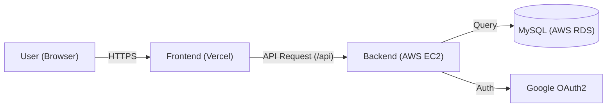
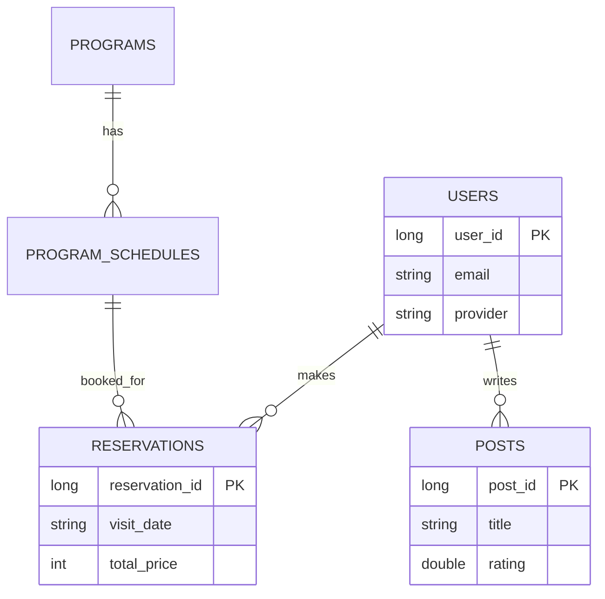

````markdown
# 🌊 Naquarium Archive (나쿠아리움)

> **"보이지 않던 바다, 그 너머의 기록"**
>
> 심해 3,000m의 미지 생태계와 멸종 위기종을 디지털로 복원하여 보존하는 가상의 디지털 아쿠아리움 예약/커뮤니티 서비스입니다.


<br/>

## 1. 프로젝트 개요

- **프로젝트명:** Naquarium Archive
- **개발 기간:** 2026.01 ~ 2026.02 (진행 중)
- **개발 인원:** 1인 (Full Stack)
- **배포 URL:** [배포된 링크가 있다면 입력](https://aquarium-sand.vercel.app)

<br/>

## 2. 주요 기능 (Key Features)

- **회원 관리:** 일반 로그인(Spring Security) 및 **Google OAuth 2.0 소셜 로그인**
- **예매 시스템:** 관람권/프로그램 날짜 및 인원별 가격 계산, 예약 관리
- **결제 모듈:** 포트원(PortOne) API를 활용한 가상 결제 연동
- **커뮤니티:** 관람 후기 작성, 별점 평가, Kakao Map API 연동 오시는 길

<br/>

## 3. 기술 스택 (Tech Stack)

### 🎨 Frontend

- **Core:** React 19, TypeScript, Vite
- **Styling:** Styled-components
- **State:** Context API
- **Network:** Axios

### 🛠 Backend

- **Core:** Java 21, Spring Boot 3.5.10
- **Data:** MySQL 8.0, Spring Data JPA
- **Security:** Spring Security 6, OAuth2 Client
- **Infra:** AWS EC2, AWS RDS

<br/>

## 4. 시스템 아키텍처


````

## 5. 트러블 슈팅 (Troubleshooting) 🔥

### 1) 로컬/배포 환경의 DB 연결 분리 (Environment Variables)

- **문제:** 로컬(`localhost`)과 배포(`AWS RDS`) 환경의 DB 주소가 달라, 배포할 때마다 코드를 수정해야 하는 번거로움과 보안 위험이 있었습니다.
- **해결:** Spring Boot의 `application.properties` 설정에 **환경 변수 치환 문법**을 적용했습니다.

```properties
# 환경변수(DB_URL)가 있으면 로컬 주소를 쓰고, 없으면 AWS 주소(기본값)를 사용
spring.datasource.url=${DB_URL:jdbc:mysql://naquarium-db...rds.amazonaws.com...}

```

- 이를 통해 코드 수정 없이 로컬과 서버 환경을 완벽하게 분리하고 자동화했습니다.

### 2) OAuth2 소셜 로그인 유저의 정보 수정

- **문제:** 소셜 로그인(구글) 유저는 비밀번호가 없는데, 회원 정보 수정 시 비밀번호 확인 로직을 타면서 에러가 발생했습니다.
- **해결:** 로그인 `Provider` 타입을 체크하여, 소셜 유저는 비밀번호 검증 단계를 건너뛰도록 조건부 로직(`UserService`)을 구현하여 해결했습니다.

## 6. ERD (데이터 구조)



## 7. 실행 방법 (How to run)

### Backend

1. IntelliJ 실행 설정(Edit Configurations)에서 환경 변수(`DB_URL`, `DB_USERNAME` 등)를 로컬 DB 정보로 설정합니다.
2. `./gradlew bootRun` 명령어로 실행합니다.

### Frontend

1. `npm install`로 의존성을 설치합니다.
2. `npm run dev`로 개발 서버를 실행합니다.

---

Contact: kitpractice703@gmail.com
