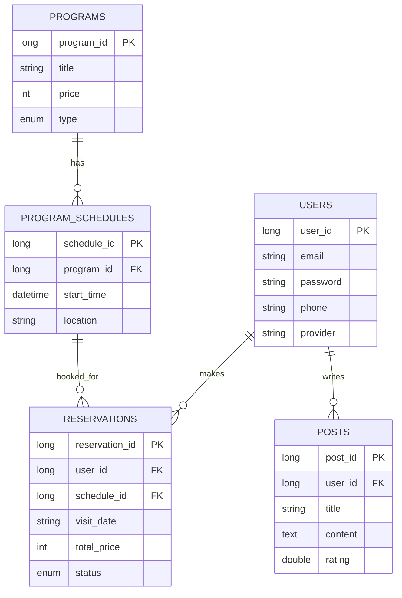

# 🌊 Naquarium Archive (나쿠아리움)

> **"보이지 않던 바다, 그 너머의 기록"**
> 심해 3,000m의 미지 생태계와 멸종 위기종을 디지털로 복원하여 보존하는 가상의 디지털 아쿠아리움 예약/커뮤니티 서비스입니다.


## 1. 프로젝트 개요

- **프로젝트명:** Naquarium Archive (나쿠아리움 아카이브)
- **개발 기간:** 2026.01 ~ 2026.02 (진행 중)
- **개발 인원:** 1인 (Full Stack)
- # **배포 URL:** https://aquarium-sand.vercel.app

## 1. 프로젝트 개요

- **프로젝트명:** Naquarium Archive (나쿠아리움 아카이브)
- **개발 기간:** 2026.01 ~ 2026.02 (진행 중)
- **개발 인원:** 1인 (Full Stack)
- **배포 URL:** https://aquarium-sand.vercel.app

## 2. 기획 의도 및 주요 기능

단순한 정보 제공 사이트를 넘어, 사용자가 **몰입감 있는 경험(VR 체험, 먹이 주기 등)**을 예약하고, **커뮤니티**를 통해 경험을 공유할 수 있는 플랫폼을 구축하고자 했습니다.

### 🔑 Key Features

1. **회원 관리 & 인증 (Security)**

- 일반 이메일 회원가입/로그인 (BCrypt 암호화)
- **OAuth 2.0 기반 Google 소셜 로그인** 구현
- 정보 수정 및 비밀번호 변경 시 보안을 위한 재로그인 프로세스

2. **예매 및 결제 시스템**

- **관람권 예매:** 날짜 및 인원 선택에 따른 가격 자동 계산
- **프로그램 예약:** VR 다이빙, 먹이 주기 체험 등 시간대별(Time-slot) 예약 시스템
- **가상 결제 모듈:** 커스텀 결제 모달을 통한 결제 프로세스 구현

3. **마이페이지 & 예약 관리**

- 예매 내역 조회 (공연/체험/관람권 구분 뱃지 표시)
- 개인정보(전화번호 등) 수정 및 유효성 검사

4. **커뮤니티 & 고객 지원**

- 관람 후기 작성 (별점 시스템 포함)
- 자주 묻는 질문(FAQ) 아코디언 UI
- # **Kakao Map API**를 활용한 오시는 길 안내

* 일반 이메일 회원가입/로그인 (BCrypt 암호화)
* **OAuth 2.0 기반 Google 소셜 로그인** 구현
* 정보 수정 및 비밀번호 변경 시 보안을 위한 재로그인 프로세스

2. **예매 및 결제 시스템**

- **관람권 예매:** 날짜 및 인원 선택에 따른 가격 자동 계산
- **프로그램 예약:** VR 다이빙, 먹이 주기 체험 등 시간대별(Time-slot) 예약 시스템
- **가상 결제 모듈:** 커스텀 결제 모달을 통한 결제 프로세스 구현

3. **마이페이지 & 예약 관리**

- 예매 내역 조회 (공연/체험/관람권 구분 뱃지 표시)
- 개인정보(전화번호 등) 수정 및 유효성 검사

4. **커뮤니티 & 고객 지원**

- 관람 후기 작성 (별점 시스템 포함)
- 자주 묻는 질문(FAQ) 아코디언 UI
- **Kakao Map API**를 활용한 오시는 길 안내

## 3. 기술 스택 (Tech Stack)

### 🎨 Frontend

- **Language:** TypeScript
- **Framework:** React 19 (Vite)
- **Styling:** Styled-components (CSS-in-JS)
- **State Mngt:** Context API (AuthContext)
- **HTTP Client:** Axios (Interceptor를 통한 에러 핸들링)
- **Hosting:** Vercel

### 🛠 Backend

- **Language:** Java 21
- **Framework:** Spring Boot 3.5.10
- **Database:** MySQL 8.0 (AWS RDS)
- **ORM:** JPA (Spring Data JPA)
- **Security:** Spring Security 6, OAuth2 Client
- **Build Tool:** Gradle
- # **Hosting:** AWS EC2

* **Language:** TypeScript
* **Framework:** React 19 (Vite)
* **Styling:** Styled-components (CSS-in-JS)
* **State Mngt:** Context API (AuthContext)
* **HTTP Client:** Axios (Interceptor를 통한 에러 핸들링)
* **Hosting:** Vercel

### 🛠 Backend

- **Language:** Java 21
- **Framework:** Spring Boot 3.5.10
- **Database:** MySQL 8.0 (AWS RDS)
- **ORM:** JPA (Spring Data JPA)
- **Security:** Spring Security 6, OAuth2 Client
- **Build Tool:** Gradle
- **Hosting:** AWS EC2

## 4. 시스템 아키텍처 (Architecture)

graph LR
User["User (Browser)"] -->|HTTPS| Frontend["Frontend (React / Vercel)"]
Frontend -->|"API Request"| Backend["Backend (Spring Boot / AWS EC2)"]
Backend -->|CRUD| DB[("MySQL (AWS RDS)")]
Backend -->|Auth| Google["Google OAuth2 Server"]

## 5. 트러블 슈팅 (Troubleshooting) 🔥 _[포트폴리오 핵심]_

=======
User["User (Browser)"] -->|HTTPS| Frontend["Frontend (React / Vercel)"]
Frontend -->|"API Request"| Backend["Backend (Spring Boot / AWS EC2)"]
Backend -->|CRUD| DB[("MySQL (AWS RDS)")]
Backend -->|Auth| Google["Google OAuth2 Server"]

## 5. 트러블 슈팅 (Troubleshooting) 🔥 _[포트폴리오 핵심]_

개발 과정에서 겪은 주요 문제와 해결 과정을 기록했습니다.

### 1) 로컬/배포 환경 간의 DB 연결 및 설정 분리

- **문제:** 로컬(`localhost`)과 배포(`EC2`) 환경에서 DB 주소가 달라 매번 코드를 수정해야 하는 번거로움 발생.
- **해결:** Spring Boot의 `application.properties`에서 **환경 변수 치환 문법**을 활용.
- `${DB_URL:기본값}` 문법을 사용하여, 로컬에서는 IDE 환경 변수로 `DB_URL`을 주입받고, 배포 서버에서는 기본값(RDS 주소)을 사용하도록 구성하여 **코드 수정 없는 배포 파이프라인** 구축.

### 2) OAuth2(구글) 사용자의 정보 수정 문제

- **문제:** 일반 회원은 정보 수정 시 `현재 비밀번호 확인` 로직을 거치지만, 비밀번호가 없는 소셜 로그인(Google) 회원은 이 로직에서 실패하는 문제 발생.
- **해결:**
- Backend: `UserService`에서 로그인 Provider(`local` vs `google`)를 확인하여, 소셜 회원은 비밀번호 검증 로직을 건너뛰도록 조건부 로직 구현.
- Frontend: 전화번호 변경 시 "새 비밀번호" 입력란의 UX를 개선하여 불필요한 입력을 방지.

### 3) CORS 및 Proxy 설정

- **문제:** Frontend(`Vercel`)와 Backend(`EC2`)의 도메인이 달라 발생하는 CORS(Cross-Origin Resource Sharing) 이슈 및 쿠키 공유 문제.
- **해결:**
- 개발 환경(Vite): `vite.config.ts`의 `proxy` 설정을 통해 `/api` 요청을 로컬 백엔드로 우회.
- # 배포 환경: `SecurityConfig`에서 `AllowedOrigins`를 명시적으로 허용하고, `WebMvcConfigurer`를 통해 전역 CORS 정책 설정.

* **문제:** 로컬(`localhost`)과 배포(`EC2`) 환경에서 DB 주소가 달라 매번 코드를 수정해야 하는 번거로움 발생.
* **해결:** Spring Boot의 `application.properties`에서 **환경 변수 치환 문법**을 활용.
* `${DB_URL:기본값}` 문법을 사용하여, 로컬에서는 IDE 환경 변수로 `DB_URL`을 주입받고, 배포 서버에서는 기본값(RDS 주소)을 사용하도록 구성하여 **코드 수정 없는 배포 파이프라인** 구축.

### 2) OAuth2(구글) 사용자의 정보 수정 문제

- **문제:** 일반 회원은 정보 수정 시 `현재 비밀번호 확인` 로직을 거치지만, 비밀번호가 없는 소셜 로그인(Google) 회원은 이 로직에서 실패하는 문제 발생.
- **해결:**
- Backend: `UserService`에서 로그인 Provider(`local` vs `google`)를 확인하여, 소셜 회원은 비밀번호 검증 로직을 건너뛰도록 조건부 로직 구현.
- Frontend: 전화번호 변경 시 "새 비밀번호" 입력란의 UX를 개선하여 불필요한 입력을 방지.

### 3) CORS 및 Proxy 설정

- **문제:** Frontend(`Vercel`)와 Backend(`EC2`)의 도메인이 달라 발생하는 CORS(Cross-Origin Resource Sharing) 이슈 및 쿠키 공유 문제.
- **해결:**
- 개발 환경(Vite): `vite.config.ts`의 `proxy` 설정을 통해 `/api` 요청을 로컬 백엔드로 우회.
- 배포 환경: `SecurityConfig`에서 `AllowedOrigins`를 명시적으로 허용하고, `WebMvcConfigurer`를 통해 전역 CORS 정책 설정.

## 6. ERD (Entity Relationship Diagram)



- **Users:** 사용자 정보 (Email, Password, Provider, Phone)
- **Reservations:** 예매 정보 (VisitDate, Count, Price, Status)
- `Users`와 1:N 관계
- `ProgramSchedules`와 N:1 관계 (프로그램 예약 시)

- **Programs / ProgramSchedules:** 프로그램 정보 및 시간표
- # **Posts:** 커뮤니티 게시글

* **Users:** 사용자 정보 (Email, Password, Provider, Phone)
* **Reservations:** 예매 정보 (VisitDate, Count, Price, Status)
* `Users`와 1:N 관계
* `ProgramSchedules`와 N:1 관계 (프로그램 예약 시)

* **Programs / ProgramSchedules:** 프로그램 정보 및 시간표
* **Posts:** 커뮤니티 게시글

## 7. 실행 방법 (How to run)

### Backend

1. `backend/src/main/resources/application.properties`의 DB 설정을 본인 환경에 맞게 수정합니다.
2. 프로젝트 루트에서 다음 명령어를 실행합니다.

=======

```bash
./gradlew bootRun

```

<<<<<<< HEAD

### Frontend

1. 프로젝트 폴더로 이동하여 의존성을 설치합니다.

=======

### Frontend

1. 프로젝트 폴더로 이동하여 의존성을 설치합니다.

```bash
npm install

```

<<<<<<< HEAD 2. 개발 서버를 실행합니다.

=======

2. 개발 서버를 실행합니다.

```bash
npm run dev

```

---

Contact: kitpractice703@gmail.com
