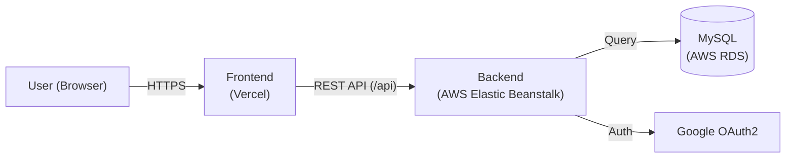
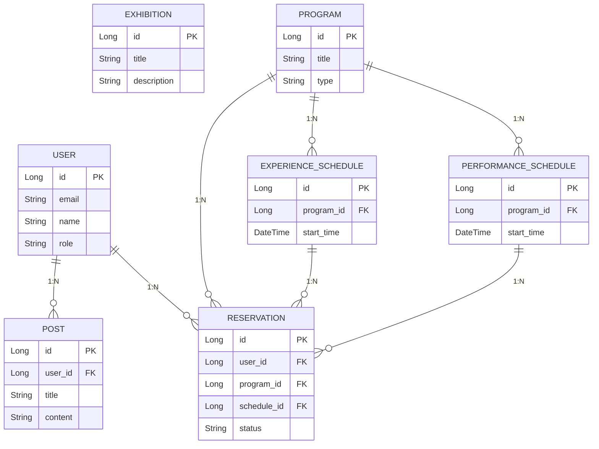

# Naquarium Archive

> **"보이지 않던 바다, 그 너머의 기록"**
>
> 심해 3,000m의 미지 생태계와 멸종 위기종을 디지털로 복원하여 보존하는 가상의 아쿠아리움 예약/커뮤니티 서비스입니다.


<br/>

## 1. 프로젝트 개요

| 항목       | 내용                              |
| ---------- | --------------------------------- |
| 프로젝트명 | Naquarium Archive                 |
| 개발 기간  | 2025.12 ~ 2026.02 (지속 수정중)   |
| 배포 URL   | https://aquarium-livid.vercel.app |

<br/>

## 2. 주요 기능

| 기능            | 설명                                                                             |
| --------------- | -------------------------------------------------------------------------------- |
| 회원 관리       | 이메일/비밀번호 회원가입·로그인, Google OAuth 2.0 소셜 로그인, 비밀번호 재설정   |
| 예매 시스템     | 관람권(입장권) 날짜·인원별 예매, 프로그램(공연/체험) 예약, 마이페이지 예약 내역  |
| 결제 시뮬레이션 | 카드 입력 UI → 결제 승인 → 완료의 3단계 상태 전환 애니메이션 (실제 PG 연동 없음) |
| 커뮤니티        | 관람 후기 작성·조회·별점 평가, FAQ 아코디언                                      |
| 지도            | Kakao Map API를 활용한 아쿠아리움 위치 표시                                      |

<br/>

## 3. 기술 스택

### Frontend

| 분류    | 기술                       |
| ------- | -------------------------- |
| Core    | React 19, TypeScript, Vite |
| Styling | Styled-components 6        |
| Routing | React Router DOM v7        |
| HTTP    | Axios                      |

### Backend

| 분류     | 기술                                   |
| -------- | -------------------------------------- |
| Core     | Java 21, Spring Boot 3.5.10            |
| Security | Spring Security 6, OAuth2 Client       |
| Data     | Spring Data JPA (Hibernate), MySQL 8.0 |
| Test     | JUnit 5, Mockito, H2 (in-memory)       |
| Infra    | AWS Elastic Beanstalk, AWS RDS         |

<br/>

## 4. 시스템 아키텍처


```mermaid
graph LR
    User["User (Browser)"] -->|HTTPS| Frontend["Frontend\n(Vercel)"]
    Frontend -->|"REST API (/api)"| Backend["Backend\n(AWS Elastic Beanstalk)"]
    Backend -->|Query| DB[("MySQL\n(AWS RDS)")]
    Backend -->|Auth| Google["Google OAuth2"]
```

<br/>

## 5. ERD


```mermaid
erDiagram
    EXHIBITION {
        Long id PK
        String title
        String description
    }

    USER {
        Long id PK
        String email
        String name
        String role
    }

    PROGRAM {
        Long id PK
        String title
        String type
    }

    PERFORMANCE_SCHEDULE {
        Long id PK
        Long program_id FK
        DateTime start_time
    }

    EXPERIENCE_SCHEDULE {
        Long id PK
        Long program_id FK
        DateTime start_time
    }

    RESERVATION {
        Long id PK
        Long user_id FK
        Long program_id FK
        Long schedule_id FK
        String status
    }

    POST {
        Long id PK
        Long user_id FK
        String title
        String content
    }

    USER ||--o{ RESERVATION : "1:N"
    USER ||--o{ POST : "1:N"

    PROGRAM ||--o{ PERFORMANCE_SCHEDULE : "1:N"
    PROGRAM ||--o{ EXPERIENCE_SCHEDULE : "1:N"
    PROGRAM ||--o{ RESERVATION : "1:N"

    PERFORMANCE_SCHEDULE ||--o{ RESERVATION : "1:N"
    EXPERIENCE_SCHEDULE ||--o{ RESERVATION : "1:N"
```

> **예약 타입별 nullable 관계**
>
> - 입장권: `program_id = null`, `schedule_id = null`
> - 체험 프로그램: `program_id = 프로그램 ID`, `schedule_id = null`
> - 공연 프로그램: `program_id = 프로그램 ID`, `schedule_id = 공연 회차 ID`

<br/>

## 6. 테스트

레포지토리 → 서비스 → 컨트롤러 3계층으로 테스트를 구성했습니다.

| 계층       | 클래스                      | 방식                            | 주요 검증                                              |
| ---------- | --------------------------- | ------------------------------- | ------------------------------------------------------ |
| Repository | `UserRepositoryTest`        | `@DataJpaTest` + H2             | 이메일 조회, 중복 이메일 예외, 소셜 회원 null password |
| Repository | `ReservationRepositoryTest` | `@DataJpaTest` + H2             | 관람권 보유 확인 쿼리 (`program IS NULL` 조건)         |
| Service    | `UserServiceTest`           | `@ExtendWith(MockitoExtension)` | 비밀번호 불일치 예외, 소셜 회원 제한                   |
| Controller | `AuthControllerTest`        | `@WebMvcTest` + MockMvc         | 회원가입 409 중복, 로그인 인증, 비인증 401             |
| Controller | `ReservationControllerTest` | `@WebMvcTest` + MockMvc         | 가격 계산(대인×35000 + 소인×29000), 비인증 401         |
| Controller | `PostApiControllerTest`     | `@WebMvcTest` + MockMvc         | 후기 목록 공개 접근, 후기 작성 인증 필요               |

<br/>

## 7. 트러블슈팅

### 1) 로컬/배포 환경 DB 분리

**문제:** 로컬과 AWS RDS DB 주소가 달라 배포 시마다 코드를 수정해야 하는 번거로움과 보안 위험이 있었습니다.

**해결:** `application.properties`에 환경변수 치환을 적용했습니다.

```properties
spring.datasource.url=${DB_URL}
spring.datasource.username=${DB_USERNAME}
spring.datasource.password=${DB_PASSWORD}
```

로컬에서는 IntelliJ Run Configuration의 환경 변수로, 배포 환경에서는 Elastic Beanstalk 환경 변수로 주입합니다.

---

### 2) 소셜 로그인 사용자 회원정보 수정

**문제:** Google 소셜 회원은 `password = null`인데, 회원정보 수정 시 비밀번호 확인 로직을 타면서 NPE가 발생했습니다.

**해결:** `UserService`에서 `provider` 값을 체크하여 소셜 회원은 비밀번호 검증을 건너뛰도록 분기 처리했습니다.

```java
if ("local".equals(user.getProvider())) {
    // 일반 회원만 현재 비밀번호 검증
}
```

---

### 3) 관람권 보유 확인 쿼리 — `program IS NULL` 조건

**문제:** 프로그램 예약 시 "당일 입장권 보유 여부"를 확인하는 쿼리가 프로그램 예약 건까지 입장권으로 집계하는 문제가 있었습니다.

**해결:** `Reservation` 테이블에서 입장권은 `program_id = null`로 구분합니다. `existsByUserEmailAndVisitDateAndStatus` 쿼리에 `r.program IS NULL` 조건을 추가하여 입장권 예약만 정확히 조회합니다.

```java
@Query("SELECT COUNT(r) > 0 FROM Reservation r " +
       "WHERE r.user.email = :email " +
       "AND r.visitDate = :visitDate " +
       "AND r.status = :status " +
       "AND r.program IS NULL")
boolean existsByUserEmailAndVisitDateAndStatus(...);
```

---

### 4) N+1 문제 해결

**문제:** 예약 목록 조회 시 각 예약의 `program`, `schedule` 정보를 접근할 때마다 추가 쿼리가 발생했습니다(예약 N건 → 최대 2N+1 쿼리).

**해결 방법 2가지를 상황에 맞게 적용했습니다.**

- **FETCH JOIN** (`ReservationRepository`): 예약 목록 조회 시 `program`과 `schedule`을 한 번에 로딩

```java
@Query("SELECT r FROM Reservation r " +
       "LEFT JOIN FETCH r.program " +
       "LEFT JOIN FETCH r.schedule s " +
       "LEFT JOIN FETCH s.program " +
       "WHERE r.user.email = :email ORDER BY r.reservedAt DESC")
```

- **@EntityGraph** (`PostRepository`): 후기 목록 조회 시 작성자 정보를 즉시 로딩

```java
@EntityGraph(attributePaths = {"user"})
List<Post> findByCategoryOrderByCreatedAtDesc(Post.Category category);
```

---

### 5) 크로스 도메인 세션 쿠키 (CORS + SameSite)

**문제:** 프론트엔드(Vercel)와 백엔드(AWS)가 서로 다른 도메인에 배포되어, 로그인 후 발급된 `JSESSIONID` 세션 쿠키가 이후 요청에 포함되지 않는 문제가 발생했습니다.

**해결:** 아래 두 가지를 함께 설정했습니다.

1. **프론트엔드:** Axios 전역 설정에 `withCredentials: true` 추가
2. **백엔드:** CORS에서 `allowCredentials(true)`, 쿠키에 `SameSite=Lax`, `Secure=true` 설정

```properties
server.servlet.session.cookie.same-site=lax
server.servlet.session.cookie.secure=true
```

<br/>

## 8. 실행 방법

### Backend

```bash
# 환경변수 설정 후 실행 (IntelliJ Run Configuration 또는 .env)
# 필요 변수: DB_URL, DB_USERNAME, DB_PASSWORD, GOOGLE_CLIENT_ID, GOOGLE_CLIENT_SECRET, GOOGLE_REDIRECT_URI

./gradlew bootRun
```

### Frontend

```bash
cd frontend
npm install
npm run dev
```

<br/>

---

Contact: kitpractice703@gmail.com
